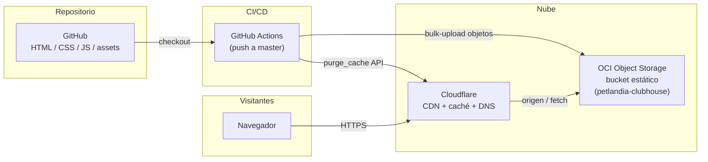

# Club House Petlandia — Landing Page

Landing page estática para **Club House Petlandia**, guardería, hotel y spa para mascotas en Madrid, Cundinamarca.

---

## Secciones de la página

| Sección      | Descripción                                           |
|-------------|--------------------------------------------------------|
| **Hero**    | Portada con imagen y CTA de WhatsApp                  |
| **Servicios** | Tarjetas flip: Guardería Canina/Felina, Plan Pasadía (con video), Grooming, Pet Shop, Paseos |
| **Por qué elegirnos** | Filosofía + espacios con imágenes             |
| **Clientes felices** | Galería de mascotas con descripciones manuales   |
| **Reseñas** | Opiniones (manual o API de Google)                    |
| **Contacto** | Formulario + enlace a WhatsApp                        |

---

## Personalización

### Galería "Nuestros Clientes Felices"
- **Imágenes**: Guarda fotos en `assets/gallery/` y actualiza el `src` en cada tarjeta del HTML.
- **Descripciones**: Edita el texto en cada `.gallery-flip__desc`. Usa términos SEO (Madrid, Cundinamarca, guardería, etc.) y tono testimonial.

### Reseñas de Google Maps
- **Manual**: Reemplaza el texto de las tarjetas por reseñas reales.
- **Dinámico**: Requiere API key de Google Cloud (Places API) y Place ID.

### WhatsApp
- Número por defecto en `js/main.js`: `573028574019`. Cambia la constante `WHATSAPP_NUMBER` si hace falta.

---

## Tecnologías

- HTML5
- CSS3 (variables, grid, flexbox, media queries)
- JavaScript (vanilla, sin frameworks)
- Alojamiento estático en **Oracle Cloud Infrastructure (Object Storage)** delante de **Cloudflare** (CDN y caché)

---

## Arquitectura

Vista general: código en GitHub → despliegue automático al bucket OCI → los visitantes llegan por Cloudflare (DNS/proxy/caché), que sirve el origen del bucket.



Resumen estructurado (útil para IA y checklists de infra):

```yaml
# petlandia-landing-architecture — resumen operativo
name: Club House Petlandia Landing
pattern: static_site
runtime: none  # sin servidor de aplicaciones; solo archivos estáticos

repository:
  host: github
  default_branch: master

source_tree:
  entry: index.html
  styles: css/style.css
  scripts: js/main.js
  assets: assets/icons/, assets/gallery/

delivery_pipeline:
  trigger: push_to_master
  ci: github_actions
  workflow: .github/workflows/deploy-landing.yml
  deploy_target:
    provider: oracle_cloud_infrastructure
    service: object_storage
    bucket: petlandia-clubhouse
    namespace: axnplbo9mhwv
  post_deploy:
    - cloudflare_cache_purge  # API zones/:id/purge_cache purge_everything

edge_and_caching:
  provider: cloudflare
  role: dns_proxy_cdn_cache
  cache_invalidation: automated_after_each_deploy

external_integrations:
  - whatsapp_deeplinks  # js/main.js
  - google_maps_iframe  # index.html
```

**Secrets de GitHub Actions (despliegue):** OCI (`OCI_USER_OCID`, `OCI_FINGERPRINT`, `OCI_TENANCY_OCID`, `OCI_REGION`, `OCI_KEY_FILE`). **Post-despliegue:** Cloudflare `CLOUDFLARE_ZONE_ID`, `CLOUDFLARE_API_TOKEN` (permiso *Cache Purge* en la zona).

---

## Contacto

- **Ubicación**: Madrid, Cundinamarca  
- **Instagram**: [@petlandia_clubhouse](https://www.instagram.com/petlandia_clubhouse)  
- **Facebook**: [Petlandia Club House](https://www.facebook.com/p/Petlandia-Club-House-61572618735484/)  
- **WhatsApp**: 302 857 4019  
